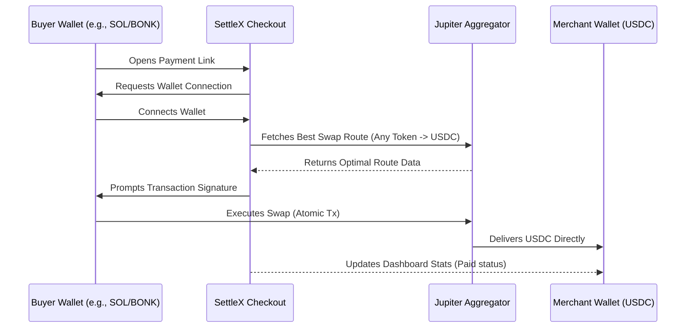

# SettleX ⚡️

**Non-custodial Solana checkout and payment links.**

SettleX is a modern, decentralized payment platform built on the Solana blockchain. It enables merchants, creators, and freelancers to generate payment links and seamlessly accept cryptocurrency payments directly into their own wallets. 

Built with Next.js, Prisma, and the Jupiter Aggregator, SettleX provides a premium, "Web2-like" checkout experience powered by Web3 rails.

---

## 🛑 The Problem

Traditional payment gateways (like Stripe or PayPal) and even some centralized crypto payment processors suffer from significant drawbacks:
1. **High Fees:** Taking 2-3% + fixed fees per transaction.
2. **Custodial Risk & Holds:** Processors hold your funds and can freeze accounts or delay payouts.
3. **Friction for Buyers:** If a merchant wants USDC, but the buyer only has SOL or BONK, the buyer typically has to leave the checkout, go to an exchange, swap tokens, and come back. This causes massive drop-off rates.

## 💡 How SettleX Solves It

SettleX completely reimagines the checkout flow by leveraging the speed of Solana and the liquidity of Jupiter:

1. **100% Non-Custodial:** SettleX never touches your funds. Payments go directly from the buyer's wallet to the merchant's wallet in a single on-chain transaction.
2. **Instant Settlement:** Thanks to Solana, funds arrive in your wallet in less than a second. Zero payout delays.
3. **Seamless Swaps via Jupiter:** A buyer can pay with *any* token in their wallet. SettleX automatically routes the transaction through Jupiter under the hood, swapping the buyer's token for the merchant's requested token (e.g., USDC) in real-time. The merchant always gets exactly what they asked for.

### 🏗 Architecture & Payment Flow



---

## 🛠 Tech Stack

- **Frontend:** Next.js (App Router), React, Tailwind CSS, Aceternity UI, Framer Motion
- **Backend/DB:** Next.js API Routes, Prisma ORM, PostgreSQL (Aiven)
- **Web3:** `@solana/web3.js`, Jupiter API v6, Wallet Adapter
- **Design:** Modern Neumorphic-lite UI, responsive and dark-mode ready

## 🚀 Getting Started

1. **Clone the repository**
2. **Install dependencies:**
   ```bash
   npm install
   ```
3. **Environment Setup:**
   Create a `.env` file based on your configuration. You will need:
   - A PostgreSQL Database URL
   - Solana RPC URL (e.g., Helius)
   - Jupiter API Key (if applicable)
   - Auth Secret
4. **Database Setup:**
   ```bash
   npx prisma generate
   npx prisma db push
   ```
5. **Run the development server:**
   ```bash
   npm run dev
   ```

---

## 📄 License

MIT License

Copyright (c) 2024 SettleX

Permission is hereby granted, free of charge, to any person obtaining a copy
of this software and associated documentation files (the "Software"), to deal
in the Software without restriction, including without limitation the rights
to use, copy, modify, merge, publish, distribute, sublicense, and/or sell
copies of the Software, and to permit persons to whom the Software is
furnished to do so, subject to the following conditions:

The above copyright notice and this permission notice shall be included in all
copies or substantial portions of the Software.

THE SOFTWARE IS PROVIDED "AS IS", WITHOUT WARRANTY OF ANY KIND, EXPRESS OR
IMPLIED, INCLUDING BUT NOT LIMITED TO THE WARRANTIES OF MERCHANTABILITY,
FITNESS FOR A PARTICULAR PURPOSE AND NONINFRINGEMENT. IN NO EVENT SHALL THE
AUTHORS OR COPYRIGHT HOLDERS BE LIABLE FOR ANY CLAIM, DAMAGES OR OTHER
LIABILITY, WHETHER IN AN ACTION OF CONTRACT, TORT OR OTHERWISE, ARISING FROM,
OUT OF OR IN CONNECTION WITH THE SOFTWARE OR THE USE OR OTHER DEALINGS IN THE
SOFTWARE.
