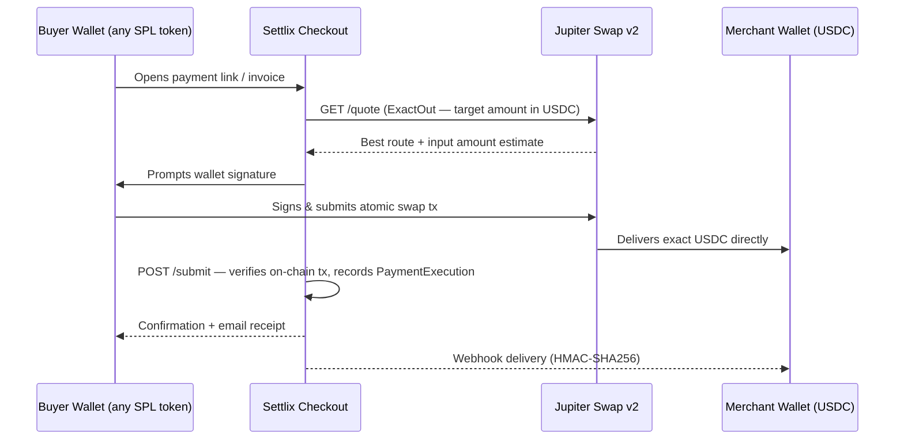
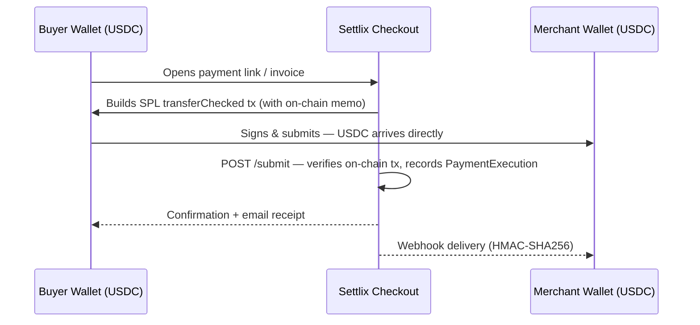

# Settlix

**Non-custodial Solana payment infrastructure for merchants and creators.**

Settlix lets merchants generate payment links, invoices, and subscriptions that accept any SPL token. Buyers pay with whatever they hold; merchants always receive the exact USDC amount they specified — settled wallet-to-wallet in under a second via Jupiter's ExactOut swap.

Built for the [Colosseum Frontier 2026 Hackathon](https://colosseum.org) — Payments & Remittance track.

---

## The Problem

- Centralized gateways (Stripe, PayPal, Coinbase Commerce) charge 2–3% and can freeze accounts or delay payouts.
- If a merchant wants USDC but the buyer only has BONK or SOL, the sale dies — the buyer has to leave, swap manually, and come back.
- Coinbase Commerce shut down on March 31 2026, leaving international merchants with no replacement (their successor is US + Singapore only).

## How Settlix Solves It

1. **Non-custodial.** Funds go directly from the buyer's wallet to the merchant's wallet. Settlix never holds anything.
2. **Any token in, exact USDC out.** Jupiter's ExactOut swap API atomically converts the buyer's token and delivers the precise amount the merchant requested.
3. **Zero platform fee.** The only cost is the Solana network fee (~$0.00025).
4. **Sub-second settlement.** Solana finalizes in under a second. No payout delays, no holds.

---

## Payment Flow

### Jupiter swap path (buyer pays a different token)



### Direct settlement path (buyer pays USDC directly)



Both paths converge at `lib/services/payment-submit.service.ts`, which verifies the transaction on-chain, upserts a `PaymentExecution` record (idempotent on `clientExecutionId`), fires the merchant webhook, and sends email receipts.

---

## Features

| Feature                | Details                                                 |
| ---------------------- | ------------------------------------------------------- |
| Payment links          | Fixed-amount or open-amount, shareable URL              |
| Invoices               | One-off requests with due dates and line items          |
| Subscriptions          | Daily / weekly recurring billing via relayer keypair    |
| Split payments         | Up to 10 recipients, basis-point allocation             |
| Solana Pay QR          | Native QR code flow via Solana Pay spec                 |
| Embeddable widget      | Drop-in `<script>` tag, iframe checkout (`/embed/[id]`) |
| REST API               | Full programmatic access, bearer token auth             |
| API keys               | SHA-256 hashed at rest, auto-works on all routes        |
| HMAC webhooks          | `X-Settlix-Signature: sha256=…` on every payment event  |
| Merchant personal page | `/pay/u/[merchantId]` — open-amount transfers           |
| Dashboard              | Payment history, stats, revenue charts                  |
| Email receipts         | Buyer + merchant notifications via Resend               |

---

## Tech Stack

| Layer           | Technology                                                   |
| --------------- | ------------------------------------------------------------ |
| Framework       | Next.js 16 (App Router), React 19                            |
| Styling         | Tailwind CSS v4, shadcn/ui, Radix UI                         |
| Animation       | Motion (Framer Motion v12)                                   |
| Icons           | Phosphor Icons, Lucide                                       |
| Charts          | Recharts                                                     |
| ORM             | Prisma 7 (`@prisma/adapter-pg`)                              |
| Database        | PostgreSQL (Aiven)                                           |
| Auth            | Ed25519 wallet-signature → HS256 JWT (jose), httpOnly cookie |
| Web3            | `@solana/web3.js`, `@solana/spl-token`, Wallet Adapter       |
| Swaps           | Jupiter Swap v2 (`swapMode=ExactOut`)                        |
| Email           | Resend                                                       |
| Validation      | Zod                                                          |
| Package manager | Bun                                                          |

---

## Architecture

### Route Groups

- **`(pay)/`** — Public buyer-facing pages: landing, payment link checkout (`/pay/[id]`), invoice (`/invoice/[id]`), subscription signup (`/subscribe/[id]`), merchant personal page (`/pay/u/[merchantId]`), docs.
- **`(site)/`** — Authenticated merchant dashboard (`/dashboard/*`) and wallet auth (`/auth`).
- **`embed/[id]/`** — Stripped iframe for the embeddable checkout widget.
- **`api/`** — All API routes. Auth handled per-route via `requireAuth` or `requireSession`.

### Authentication

Two layers share the same `requireAuth(req)` call:

1. **Session cookie** — Client signs a nonce with their Solana wallet → server verifies Ed25519 signature → 24-hour HS256 JWT stored as `settlix_session` httpOnly cookie.
2. **Bearer API key** — `Authorization: Bearer <key>`. SHA-256 hashed and looked up in the `ApiKey` table. Takes priority over session cookie.

### Key Invariants

- `PaymentExecution.clientExecutionId` is the idempotency key — submit endpoint is safe to retry.
- `PaymentExecution` uses `onDelete: Restrict` on all parent relations — payment records are permanent proof and cannot be deleted.
- `SplitRecipient.basisPoints` must sum to 10000 across all recipients.
- Subscription renewals are daily or weekly (no monthly). The relayer keypair must be pre-authorized by the subscriber.

---

## Getting Started

### Prerequisites

- [Bun](https://bun.sh) ≥ 1.2
- PostgreSQL database
- Solana RPC endpoint (e.g. Helius)
- Jupiter API key

### Setup

```bash
# Install dependencies
bun install

# Copy and fill environment variables
cp .env.example .env.local

# Generate Prisma client
bun run db:generate

# Apply schema
bun run db:push

# (Optional) Seed demo data
bun run db:seed

# Start dev server
bun dev
```

### Environment Variables

| Variable                            | Purpose                                             |
| ----------------------------------- | --------------------------------------------------- |
| `DATABASE_URL`                      | PostgreSQL connection string                        |
| `NEXT_PUBLIC_SOLANA_NETWORK`        | `mainnet-beta` or `devnet`                          |
| `NEXT_PUBLIC_SOLANA_RPC_URL`        | Client-side RPC endpoint                            |
| `SOLANA_RPC_URL`                    | Server-side RPC endpoint                            |
| `JUPITER_API_KEY`                   | Jupiter Swap v2 API key                             |
| `AUTH_SECRET`                       | JWT signing secret (`openssl rand -base64 32`)      |
| `RESEND_API_KEY`                    | Transactional email                                 |
| `SUBSCRIPTION_RELAYER_KEYPAIR_JSON` | Hot wallet keypair JSON for subscription renewals   |
| `CRON_SECRET`                       | Shared secret for `POST /api/cron/process-renewals` |

---

## License

MIT License — Copyright (c) 2026 Settlix
